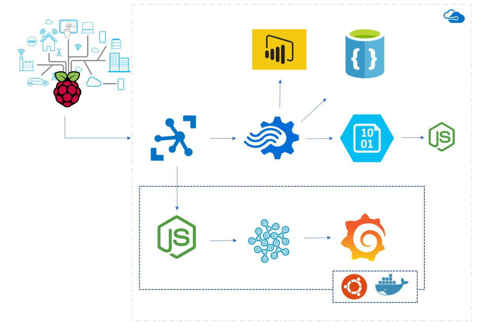

# The PI Environmental monitor #

<!-- markdownlint-disable MD033 -->

The idea: Rig a raspberry pi with a few environmental sensors, let sensor data flow into the cloud and be used for various scary purposes :bowtie: 

The Raspberry PI is a great, low-cost experimental platform. The potential for moving beyond experimental is high. Collecting environmental data like temperature, humidity, barometric pressure and light level are just easy accessible examples. The list of sensors that easily can be attached to this devices is huge.

From a technical perspective I wanted to get more knowledge in using cloud solutions, SaaS/PaaS services, communication using api's and message buses.

Obviously, collecting sensor data was done using a Raspberry PI :smile:. For the back-end part I choose to experiment with various services in the Azure eco-system and ended up using [Azure IOT Hub](https://azure.microsoft.com/en-us/services/iot-hub/) to manage devices and collect data from devices, [Azure Stream Analytics](https://azure.microsoft.com/en-us/services/stream-analytics/) for real time processing of the data the devices where sending and various Azure storage options to get some insight into the options. For my purpose the [Azure DocumentDB](https://azure.microsoft.com/en-us/services/documentdb/) seemed like a good companion.

Even though the options seems pretty unlimited when working in eco-system like Azure, it is also quite obvious the you are guided in a certain direction driven by which services that are connected to each other. The way of least resistance is tempting one :fearful:. For the analytics purposes of my sensor data there were some very obvious choices in the Azure eco-system, the direct connection between Stream Analytics and [Power BI](https://powerbi.microsoft.com/en-us/documentation/powerbi-azure-and-power-bi/) being one.

I played around with Power BI and did not really find the use for real time data that convincing and decided to explore other options - like [Grafana](https://grafana.net). Sounds easy, but not straight forward. My data were apparently locked down in a document database with not standard support from Grafana or the community.

Read more about

* [The Raspberry PI Rig](docs/therig.md) 
* [Moni - Code for collecting Sensor Data](docs/moni.md)
* [Azure IOT Hub - the back end](docs/azureiot.md)
* [Using an RPi Docker Swarm to scale up](docs/rpidockerswarm.md)
* [Analyzing data with InfluxDB and Grafana](docs/influxgrafana.md)

## Architecture ##

