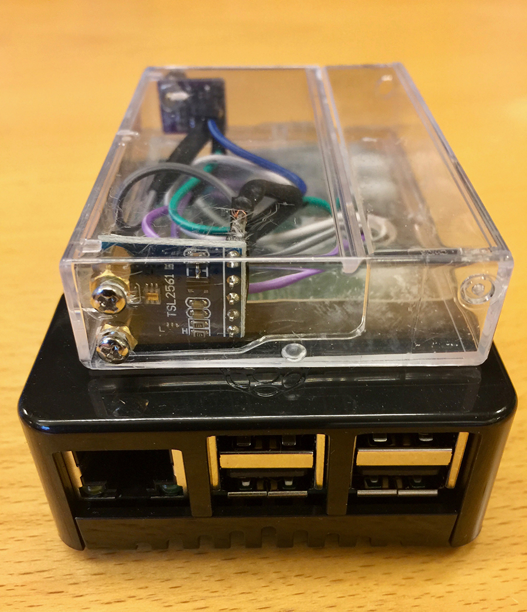

# Pi Environmental monitor #

The idea: Rig a raspberry pi with a few environmental sensors, let sensor data flow into the cloud and be used for various scary purposes.

## The Raspberry PI Rig ##

## Sensors ##

The **sensorworker.js** file is where the sensor magic happends. Update this part of the system to reflect what sensors you are using and how you pack the data into a message. Use the **sensorData** function to define you values and the **readSensors** function to do sensor magic

The current PI Ennvironment Monitor read 2 sensors from the rpi gpio. The routines from reading the sensors are small Python scripts driven by **/lib/py/sread.py**

* BME280 for providing temperature, barometric pressure and humidity
* TSL2561 to proive ambient light values in lux

## Installing & Running ##

* Clone the repo, change directory and do a "npm install"
* Make sure you have an Azure IOT Hub defined.
  * Make a note of the hub connection sting ("Shared access policies->"Policy"->"Connection string - primary key"). It goes into config "IOTHUB_CONNSTRING"
  * Make a note of the hub hostname. It goes into config "HUB_HOSTNAME"
* Update config/config.json
  * Set "MockPi" to "False" for reading sensors. Setting to "False" generates random values 
  * Set "DeviceID" to a relevant device name - like "Envmonitor1"
  * Set "HubSendInterval" to define how often the device sends sensor data to the hub (milliseconds)
* Create device identity at the hub
  * npm run-script createdevice
  * Hope for success and make a not of the "PrimaryKey"
  * Update config/config.json "DEVICE_KEY" with value from PrimaryKey
* Start sending messages with sensordata to the hub
  * npm start
* Reading messages from the hub can be done in many ways
  * npm run-script readdevice (from another terminal) could be one option

## Inspiration ##

* Azure IoT Hub Documentation https://docs.microsoft.com/azure/iot-hub/
* Azure IoT SDK on github https://github.com/Azure/azure-iot-sdks

