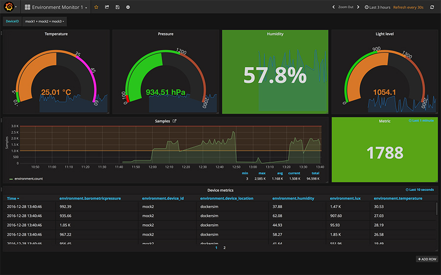

# InfluxDB and Grafana #

So, I had a lot of near-real-time data and was looking for a tool to analyze/visualize the data. I have been using Elastic Search and Kibana in previous projects and knew these systems would be able to a decent job. It was time to broaden my horizon and increase my tool box. I spent a few minutes investigating and landed on [Grafana](https://grafana.net) for visualizing my time series environmental data. Grafana have support for various types of data sources, but not the Azure documentDB that I where using.

One of the nice, and perhaps scary, attributes of software development, is that our options and possibilities are close to un-limited (if it where not for time and money ... ) I was in the need for a new place to store my time series data and selected [InfluxDB](https://www.influxdata.com). Grafana and InfluxDB are not available as native SaaS or PaaS services in Azure - which meant using a VM. Docker and Docker-Compose was coming to the rescue.

## The moniflux project ##

The moniflux project is part of the pienvironmentmonitor repository. The project contains 3 parts which all run in Docker containers:

* Grafana (The tool for visualizing data)
* InfluxDB (The database)
* monitofluxbdb (A bridge which reads messages from the Azure IOT Hub and stores them in the InfluxDB)

`Monitoinflux` is part of the `moni` program. It uses the [Node.js influx package](https://www.npmjs.com/package/influx) to talk to InfluxDB. The place to start if you want to investigate this further!

## Getting started ##

(Assuming that Docker is installed on your host)

* Clone the [pienvironmentmonitor](https://github.com/larskaare/pienvironmentmonitor.git) project
* Navigate to the `moniflux` directory
* Investigate relevant parameters in `docker-compose.yml` and define then environment variables
  * `$INFLUXDB` is the path to where the influx database will be persisted
  * `$GRAFANA` is the path to where Grafana data will be persisted
  * `$IOTHUB_CONNSTRING` is the Azure IOT Hub connection string (used in previous examples)
* Configuration files for each of the systems are available in `moniflux/grafana` and `moniflux/influxdb`. Amend these and re-build docker images to change default behaviors.

To get the eco-system up and running you do a 
~~~~
docker-compose up
~~~~

The next step will be to initialize the InfluxDB for our environment data. The [init_script.influxsql](https://github.com/larskaare/pienvironmentmonitor/blob/master/moniflux/influxdb/init_script.influxsql) describes how. We access the InfluxDB cli from the container running influx.

~~~~~
docker ps (to get the id of the influx container)
docker -ti <container id> /usr/bin/influx (to start the influx cli)
~~~~~

Copy & Paste the content of the [script](https://github.com/larskaare/pienvironmentmonitor/blob/master/moniflux/influxdb/init_script.influxsql) in-to the cli. Changing user passwords will be a good idea.

## Visualizing with Grafana ##

By default Grafana is available at port 3000. Point your browser to <host>:3000 (assuming that ports are exposed and accessible to your client)

There is a lot of good tutorial and documentation available from [grafana.net](https://grafana.net). The [getting started](http://docs.grafana.org) page is a good place to get an introduction to the basic concepts.

Login to the setup with the default admin/admin account. It would be a good idea to change the default account/password in both the configuration file and the running system.

Consider using the [Docker Swarm Simulator](docs/rpidockerswarm.md) to generate test data. Load the example dashboard for [environment data](https://github.com/larskaare/pienvironmentmonitor/blob/master/moniflux/grafana/example_dashboard.json) and start experimenting.

## Moving moniflux the cloud VM ##

At first I developed the `moniflux` project on my local computer running OS/X. Moving the set-up to Azure was quite easy and involved the following steps:

* Create a new Azure VM (Ubuntu + Docker Image)
* Expose and secure the ip endpoints
  * 8086 (InfluxDB)
  * 3000 (Grafana)
* Clone the [pienvironmentmonitor project](https://github.com/larskaare/pienvironmentmonitor.git)
* Follow the instruction in the [Getting started]() section

