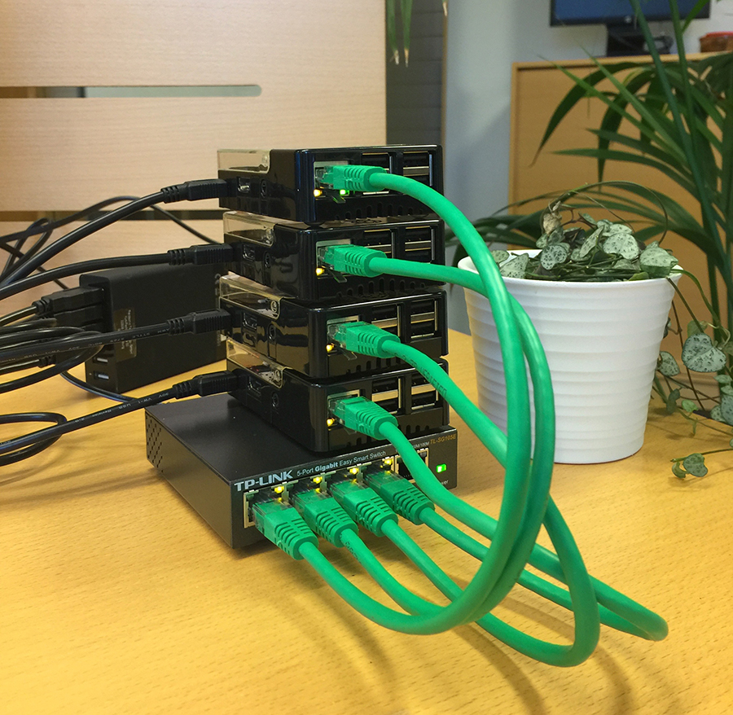

# Scaling up #

Having a few physical environment monitors are useful but not good enough to performance testing. This gave me the idea for writing a rudimentary environment simulator and packing it in a Docker container (that what the "MockPi" thing in config.json triggers). These things are quite easy these days - especially since Docker.inc made the swarm technology native as part of the engine.

To make a short story even shorter - I loaded 4 Raspberries with Rasperian Lite, added Docker, a switch, did some network stuff, clone the [pienvironmentmonitor](https://github.com/larskaare/pienvironmentmonitor), built the Docker image for [moni](https://github.com/larskaare/pienvironmentmonitor/tree/master/moni) - pushed it to docker hub and was ready for some action :smiling_imp:

## The set-up ##

I had 4 RPI's. One was set-as master and was connected to the Internet using WIFI. The other 3 where defined as nodes and communicated with the master using the wired connection. Not an optimal for a set-up where you are looking for maximum throughput - but one that I wanted to explore :smile:.

You will find good introduction on how to add Docker to the Rasperry PI, one that I inspected was the [Docker Comes to Raspberry PI](https://www.raspberrypi.org/blog/docker-comes-to-raspberry-pi/) at [raspberrypi.org](https://www.raspberrypi.org/blog/)

### A few basic command for easy reference ###

* Installing Docker (assuming you trust the source) and adding the PI user to the "docker" group (to avoid having to run as root)

~~~~~
curl -sSL https://get.docker.com | sh
sudo usermod -aG docker pi
~~~~~

* Activating Docker swarm on the master/first node. Make a note of the command to join and the swarm token

~~~~~
docker swarm init
~~~~~ 

* Joining nodes to a Docker swarm

~~~~
docker swarm join --token SWMTKN-<> <master ip>:2377
~~~~

* Building and pushing the Docker image for moni. If you do not want to build one yourself you can pull mine for the Raspberry [larskaare/rpi-envmonisim](https://hub.docker.com/r/larskaare/rpi-envmonisim/)

~~~~
/moni/docker buil -t <>/envmonisim .
push <>/envmonisim
~~~~

* Creating the service on the master node using environment variables for passing config (This set-up creates a simulator that send two messages to Azure each second containing environment data)
~~~~
docker service create --name envmonisim --replicas=2 \
    -e "IOTHUB_CONNSTRING=" \
    -e "DEVICE_KEY=" \
    -e "HUB_HOSTNAME=" \
    -e "DeviceID=" \
    -e "DeviceLocation=" \
    -e "HubSendInterval=500" \
    larskaare/rpi-envmonisim
~~~~

* Scaling simulators (X being the number of simultanious containers running)

~~~~
docker service scale envmonisim=X
~~~~

During my experiments I scaled from 0-80. 80 resulted in 80 containers distributed across 4 RPI's issuing 9.600 messages to the Azure IOT Hub every minute. This went ok for a short while - but ended when my stack got overheated :joy:. Running with 40 simulators went like a breeze.