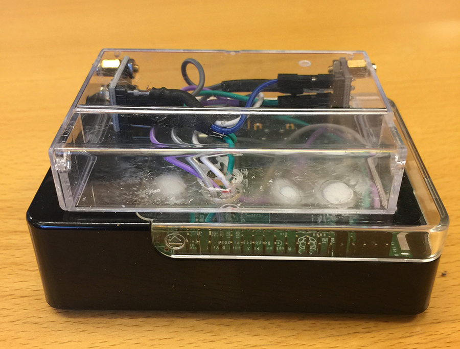

# The RPI rig #

My version of the Raspberry PI rig contains the following items:
* Raspberry PI v3 running [Raspbian](https://www.raspberrypi.org/downloads/raspbian/)
* [BME280](https://www.adafruit.com/product/2652) for providing temperature, barometric pressure and humidity
* [TSL2561](https://www.adafruit.com/products/439) to proive ambient light values in lux

Both sensors are connected to the I2C bus on the RPI. I recommend using a [breadboard](https://www.adafruit.com/products/239) for the initial experimental phase, and the bringing out the soldering iron to wrap it all up at the final phase.

The installation of the Raspbian on the RPI is quite straight forward following the initial set-up. I'm running the LITE version. Connections are done using the on-board WI-FI amending the [wpa_supplicant](https://www.raspberrypi.org/documentation/configuration/wireless/wireless-cli.md). 

I manually added support for Node.JS. The installation has become pretty straight forward:
~~~~~
wget http://node-arm.herokuapp.com/node_latest_armhf.deb 
sudo dpkg -i node_latest_armhf.deb
~~~~~

A few images of my current rig. I finally found a good use of the old Mini DV Cartidges :smile:

